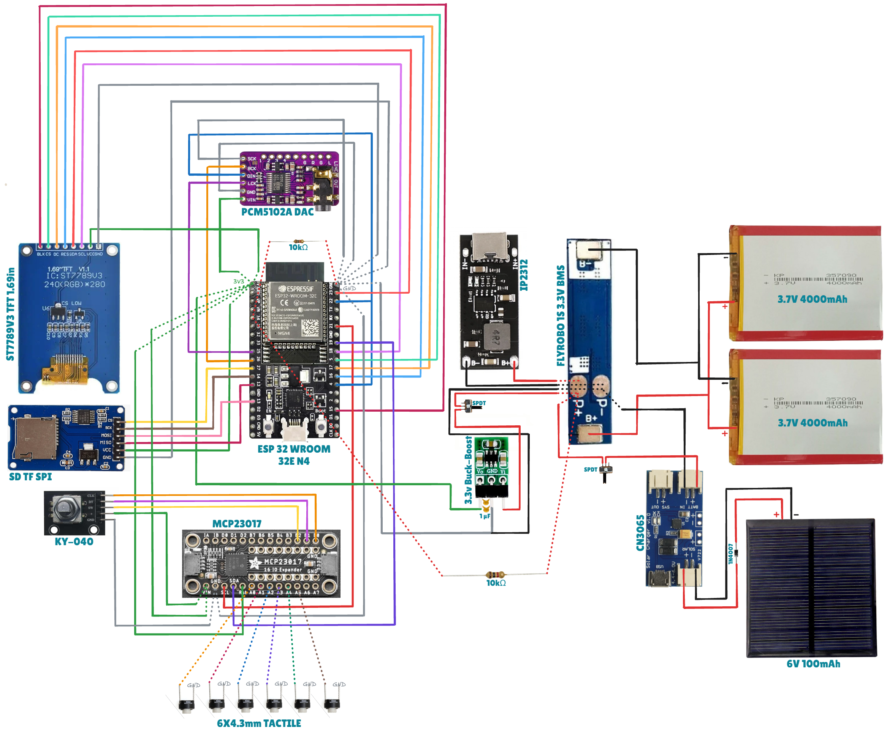

# mp3-player
Making a classic handheld MP3 player for Stardance (a YSWS program by Hack Club), with components like an ESP32 WROOM, DAC, IEMs, etc., to deliver crisp, peak 320kbps audio quality.

## About

- Hi, I'm Vedant. This is my 3rd project with [Hack Club!](https://github.com/hackclub)
- I'm designing and building a portable MP3 player from scratch, starting simple and adding features as I learn.

## Progress

Getting started — Will update as I build :)

1] Did research on hardware and components

2] Started coding for the ESP32 and functions of other components

3] Designed the UI

4] Drafted BOM.csv

5] Sought some of the perfect components for their appropriate function

6] Drafted [BOM.csv](BOM.csv) and added it to the project repo. (here!)

7] Drew the wiring diagram of the components and uploaded [wiring.png](Hardware/wiring.png) and [wiring.svg](Hardware/wiring.svg) to the repository

8] Started the coding logic and updated the wiring diagram accordingly

9] For the enclosure, the plan is to make it with transparent acrylic sheets, i.e., cast as we build

10] Added all the code to the repository [here](Firmware/MP3Player/). (Not debugged yet; will do it while I build with appropriate observation)

11] Added a [README.md](Firmware/README.md) in the [Firmware](Firmware/) directory so as to guide for setting up the firmware and libraries for the MP3 Player

12] Added [wiring.excalidraw](Hardware/wiring.excalidraw) so that maker can be independent to make changes in the wiring accordingly. (Just head to https://excalidraw.com and open the downloaded [wiring.excalidraw](Hardware/wiring.excalidraw))

13] Design complete; will shift to build once I get the materials shipped.

## LICENSE
[MIT](LICENSE) - Use, modify, share as you need to.

## Note
- I will be adding all the files step by step as I complete, organize, and progress in the project. Stay tuned!
- I will also refine this README with concise info and easy steps to BUILD once I complete the build. (Just like [README.md](Firmware/README.md) for the firmware)
- Until then, y'all will love to see my completed projects [BakeBuild- Cookie Cutters](https://github.com/vd-sh/cookie-cutters), [FuseRing- Key Rings](https://github.com/vd-sh/key-rings), [Forge- NFC Card](https://github.com/vd-sh/nfc-card) & [Macondo- Retropuzz Game](https://github.com/vd-sh/retropuzz) :)
- You can also visit my [profile](https://github.com/vd-sh) to see all of my latest repositories/projects!
